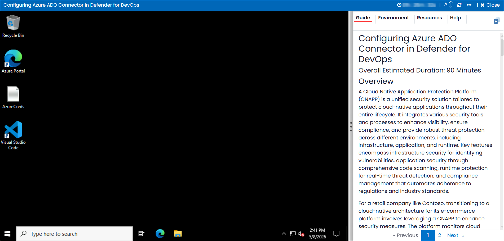
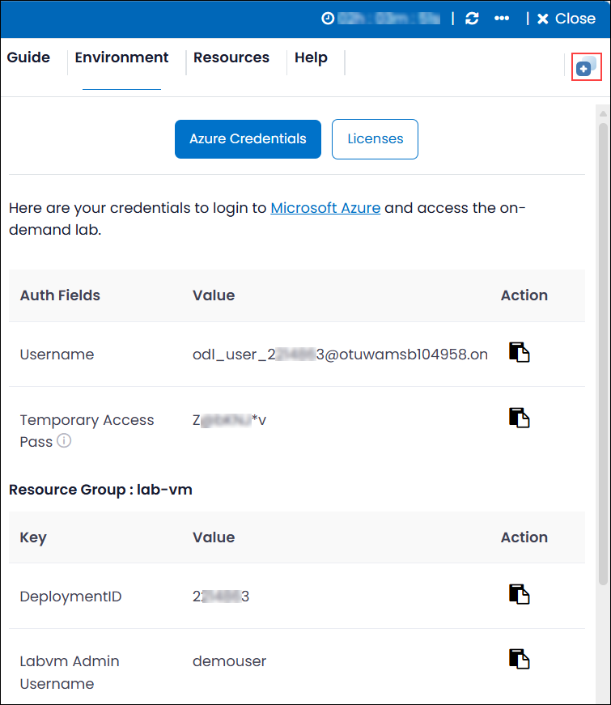
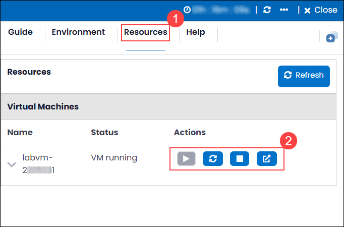
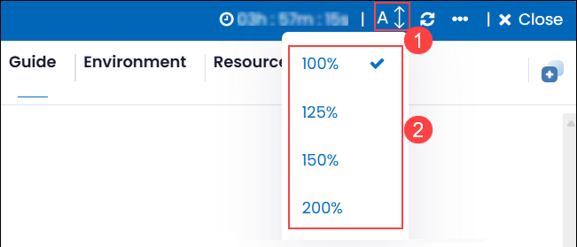
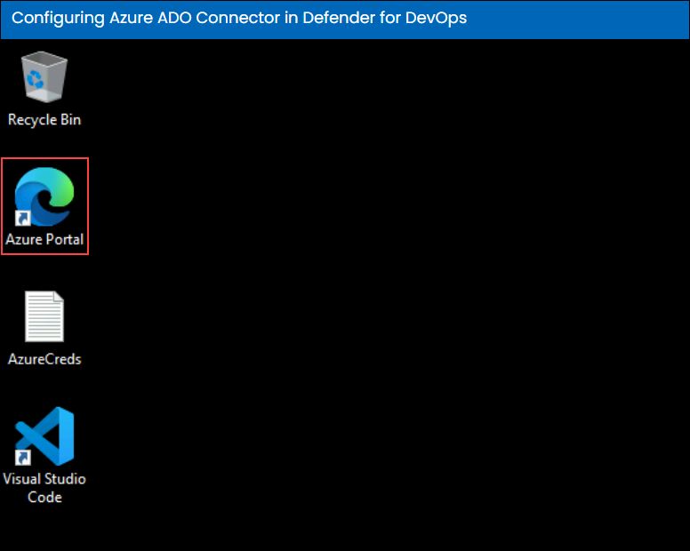
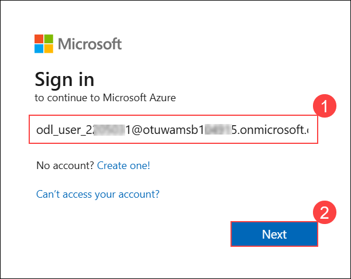
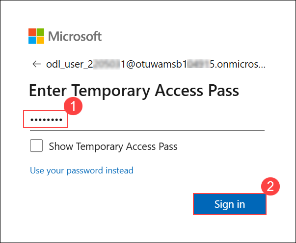
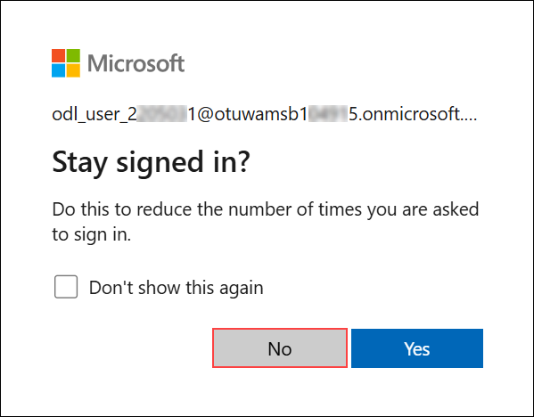

# Configuring Azure ADO Connector in Defender for DevOps

### Overall Estimated Duration: 90 Minutes

## Overview

A Cloud Native Application Protection Platform (CNAPP) is a unified security solution tailored to protect cloud-native applications throughout their entire lifecycle. It integrates various security tools and processes to enhance visibility, ensure compliance, and provide robust threat protection across different environments, including infrastructure, application, and runtime. Key features encompass infrastructure security for identifying vulnerabilities, application security through comprehensive code scanning, runtime protection for real-time threat detection, and compliance management that automates adherence to regulations and industry standards.

For a retail company like Contoso, transitioning to a cloud-native architecture for its e-commerce platform involves leveraging a CNAPP to enhance security measures. The platform monitors cloud infrastructure for misconfigurations, scans code for vulnerabilities, and detects unusual behaviors during runtime to protect against attacks.

## Objective

The objective of the CNAPP lab is to equip participants with the skills to secure and manage cloud-native applications through hands-on experience in visibility, risk assessment, and threat detection.

- **Configuring Azure ADO Connector in Defender for DevOps:** To enable seamless integration between Azure DevOps and Defender for DevOps, enhancing security insights and risk management within CI/CD pipelines.

## Prerequisites

Participants should have:

- **Basic Cloud Knowledge:** Familiarity with cloud computing concepts and Azure services.

- **Security Fundamentals:** A grasp of basic cybersecurity principles and practices.

- **DevOps Concepts:** Awareness of DevOps methodologies and practices, including CI/CD pipelines.

## Architechture

The architecture of the lab integrates various Azure services and components to create a secure, scalable environment for cloud-native applications. At the core, Azure Defender for Cloud monitors and manages the security posture of both Azure and hybrid environments, ensuring compliance and risk mitigation.Azure DevOps Services facilitate continuous integration and delivery (CI/CD) processes, while the Azure ADO Connector enhances security insights within these workflows. GitHub serves as the version control platform, integrating advanced security features to safeguard code. Additionally, Azure Virtual Machine Scale Sets ensure that applications can scale dynamically and maintain high availability, while Azure Active Directory manages user authentication and access across the entire architecture, creating a comprehensive security framework for cloud-native application development and deployment.

## Architechture Diagram

## Explanation of Components

The architecture for this lab involves the following key components:

- **Azure Defender for Cloud:** A unified security management system that helps protect Azure and hybrid environments, ensuring compliance and security posture management.

- **Docker:** A platform for developing, shipping, and running applications in containers, allowing for consistent environments across different stages of development.

- **Azure Virtual Machine Scale Sets:** A service that enables the deployment and management of a set of identical, load-balanced virtual machines, providing scalability and high availability for applications.

- **Azure DevOps Services:** A suite of development tools that support planning, collaboration, and CI/CD practices, enabling teams to build and deploy applications efficiently.

## Getting Started with Lab

Once the environment is provisioned, a virtual machine (JumpVM) and lab guide will get loaded in your browser. Use this virtual machine throughout the workshop to perform the lab.
   
## Accessing Your Lab Environment

Once you are ready to dive in, your virtual machine and lab guide will be right at your fingertips within your web browser.

### Virtual Machine & Lab Guide
 
Your virtual machine is your workhorse throughout the workshop. The lab guide is your roadmap to success.

## Exploring Your Lab Resources
 
To get a better understanding of your lab resources and credentials, navigate to the **Environment** tab.

## Utilizing the Split Window Feature
 
For convenience, you can open the lab guide in a separate window by selecting the **Split Window** button from the Top right corner.

 
## Managing Your Virtual Machine
 
Feel free to **Start, Stop, or Restart (2)** your virtual machine as needed from the **Resources (1)** tab. Your experience is in your hands!

## Lab Guide Zoom In/Zoom Out
 
To adjust the zoom level for the environment page, click the **A↕ : 100%** icon located next to the timer in the lab environment.

## Let's Get Started with Azure Portal

1. On the lab virtual machine desktop, select the **Azure Portal** icon to open and sign in to Azure.

    

1. On the **Sign in** blade, you will see a login screen, in which enter the following email/username and password and then click on **Sign in**.  

   * **Azure Username/Email**:  <inject key="AzureAdUserEmail"></inject> 

       

   * **Temperory Access Pass**:  <inject key="AzureAdUserPassword"></inject>
  
      
  
1. If you see the pop-up **Stay Signed in?** click **No**.

    

1. If a **Welcome to Microsoft Azure** popup window appears, click **Maybe Later** to skip the tour.

## Support Contact

The CloudLabs support team is available 24/7, 365 days a year, via email and live chat to ensure seamless assistance at any time. We offer dedicated support channels tailored specifically for both learners and instructors, ensuring that all your needs are promptly and efficiently addressed.

Learner Support Contacts:

- Email Support: cloudlabs-support@spektrasystems.com
- Live Chat Support: https://cloudlabs.ai/labs-support

Click **Next** from the bottom right corner to embark on your Lab journey!

### Happy Learning!!
