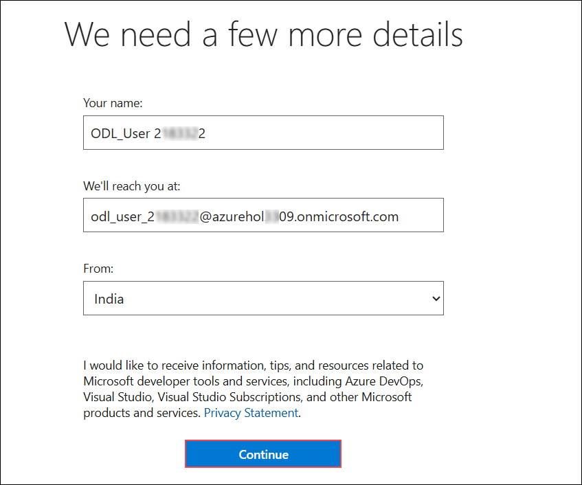
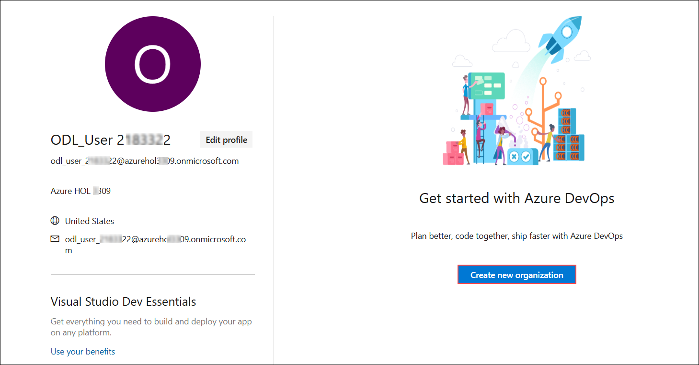
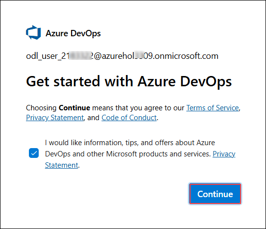
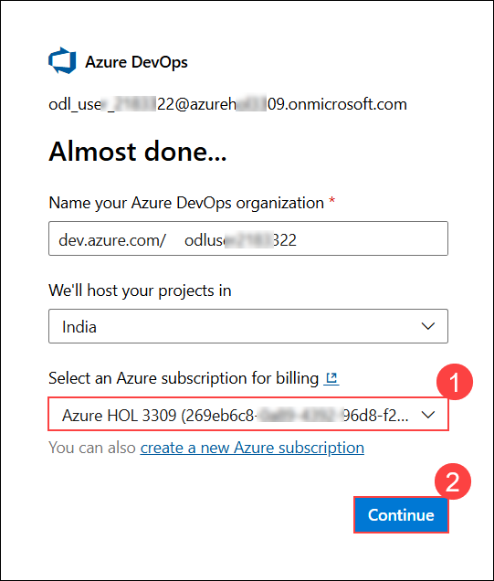

# Module: Configuring Azure ADO Connector in Defender for DevOps

### Estimated Duration: 90 Minutes

## Overview

In this module, you will learn how to configure the Azure ADO Connector in Microsoft Defender for DevOps. This integration enhances security insights and risk management within CI/CD pipelines, providing you with tools to monitor and remediate vulnerabilities across your development lifecycle seamlessly.

## Lab Objectives: 

You will be able to complete the following exercises:

- Configuring Azure ADO Connector
- Configure the Microsoft Security DevOps Azure DevOps Extension
- Install Free extension SARIF SAST Scans Tab
- Create a Hosted Build Agent and Pipeline
- Configure your pipeline using YAML

### Exercise 1: Configuring Azure ADO Connector
In this exercise you will create a new Azure DevOps organization.

1. Navigate to **Azure DevOps** using the following URL and login using the following credentials:

    ```
    https://dev.azure.com
    ```

    * Email:  **<inject key="AzureAdUserEmail" enableCopy="true"/>** 
    * Temporary Access Pass:  **<inject key="AzureAdUserPassword" enableCopy="true"/>**

1. After signing in, you will be taken to the **We need a few more details** page where the details are already prefilled, then click **Continue**.

    

1. On the **Get started with Azure DevOps** page, click **Create new organization**.

    

1. On the **Get started with Azure DevOps** page, click **Continue**.

    

1. Verify that the Azure subscription is selected under **Select an Azure subscription for billing (1)**, and then click **Continue (2)**.

    

1. Click on **Organization settings**. 

    

1. Next, select **Policies (1)** under **Security** and set the toggle button **On** for **Third-party application access via OAuth (2)** and **Allow public projects (3)**. Then click **Save (4)** on **Change policy setting** pop-up.

    

    

1. Click on **Azure Devops (1)** to navigate back to the home page. In the **Create a project to get started** pane, enter the **Project name** as **ODL_User_<inject key="Deployment ID" enableCopy="false"/> (2)** set **Visibility** to **Public (3)** and click **+ Create project (4)**. 

    

1. Navigate to **Microsoft Defender for Cloud** on the **Azure Portal**. Click on **Environment Settings (1)** click the **Add environment (2)** button and click **Azure DevOps (3)** option. 

    

1. Enter the **Connector name** for the connector as `CNAPP-Devops` **(1)**, select your **Subscription (2)**, select **asclab (3)** resource group, select any **Region (3)**. Select **Next : Configure access > (5)**.

    

1. Click **Authorize** button. If this is the first time you’re authorizing your DevOps connection, you’ll receive a pop-up screen, that will ask your permission to authorize. Scroll down the pop-up window screen and click the **Accept** button as shown in the sample below:

    

    

   > **Note**: When you click **Accept** in your Azure DevOps, you’ll notice the proof of Authorization to the **Microsoft Security DevOps** App. You can find this in your Azure ADO organization, under the **Personal Access tokens** / **User Settings** / **Authorizatons**.  

1. After the authorization is complete, select **All existing and future organizations (1)**.	Click **Review and genrate (2)** button to continue.

      

1. Click on **Create**.

      
      
1. After some minutes you will see the Azure DevOps connector in the **Environment settings** page and in about 15 minutes, you will start to seeing the total resources number populating.

      
    

   <validation step="1bdfcec7-cc4e-4c87-ad14-bb67c4034367" />    

   > **Congratulations** on completing the task! Now, it's time to validate it. Here are the steps:
   - Hit the Validate button for the corresponding task. If you receive a success message, you can proceed to the next task. 
   - If not, carefully read the error message and retry the step, following the instructions in the lab guide.
   - If you need any assistance, please contact us at labs-support@spektrasystems.com. We are available 24/7 to help you out.

This exercise involves configuring the Azure DevOps (ADO) connector to integrate and manage DevOps resources within your environment.
     
### Exercise 2: Configure the Microsoft Security DevOps Azure DevOps Extension

In this exercise, you will configure the Microsoft Security DevOps Azure DevOps Extension to enhance security integrations and capabilities within your DevOps environment.

1. Navigate back to [Azure DevOps](https://dev.azure.com) tab open in your browser. In the right corner, click in the **Shopping bag icon (1)** and click **Browse marketplace (2)** option.

       

1. In the marketplace search and select **Microsoft Security DevOps** extension.  

       

1. Next click on **Get it free**.

       

1. Choose your **Organization (1)** from the dropdown menu, select **Install (2)**.

       

       >**Note:** If this is already installed, directly move to next exercise and continue further.

1. Click on **Proceed to Organization**. 

       

1. From **Organization settings**, click on **Extensions (1)** under **Installed (2)** extensions you can view the **Microsoft Security DevOps (3)** extension that is installed. 

       

       >**Note** Admin privileges to the Azure DevOps organization are required to install the extension. If you don’t have access to install the extension, you must request access from your Azure DevOps organization’s administrator during the installation process.

This exercise involves setting up the Microsoft Security DevOps Azure DevOps Extension to integrate security features and improve DevOps processes.

### Exercise 3: Install Free extension SARIF SAST Scans Tab

In this exercise, In order to view the scan results (when you execute the pipelines), in an easier and readable format, install this free extension in your Azure DevOps organization.

1. In **Azure DevOps** from the right corner, click in the **Shopping bag icon (1)** and click **Browse marketplace (2)** option.

       
     
1. In the marketplace search and select **SARIF SANST Scans** extension.

       

1. Next click on **Get it free**.

       

1. Choose your **Organization (1)** from the dropdown menu, select **Install (2)**.

       

1. Click on **Proceed to Organization**. 

       

1. From **Organization settings**, click on **Extensions (1)** under **Installed (2)** extensions you can view the **SARIF SANST Scans (3)** extension that is installed. 

       

This exercise involves installing the free SARIF SAST Scans Tab extension to enable static application security testing and integrate it into your development environment.

### Exercise 4: Create a Hosted Build Agent and Pipeline

In this exercise, you will create a hosted build agent and pipeline to automate and manage your build processes in a DevOps environment.

1. In the **Azure Portal**, click in the search bar, type **vmss** and then click **Virtual machine scale sets**. 

       

1. Click **Create** button.

       

1. In the Create a virtual machine scale set page, select your **Subscription (1)**, select **asclab (2)** resource group, provide the **Virtual machine scale set name** as `build-agent` **(3)**, for **Region** select **<inject key="Resource group Location" enableCopy="false" /> (4)**, for **Orchestration mode** select **Uniform (5)** leave all other options as is and change the image to **Windows Server 2022 Datacentre: Azure Edition Core - x64 Gen2 (6)**.

       

1. In the same page, enter the following username and password for **VMSS** and click **Networking** tab.

      - **Username**: `demouser` 
      - **Password**: `demo!pass123`
      - **Confirm password**: `demo!pass123`

        

1. In the Networking tab, click on **Edit** under **Network Interface**.

       

1. In **Edit Network Interface** tab, set the toggle button to **Enabled** for **Public IP address (1)** and click on **OK**.

       
 
1. Once you are back on the **Networking** tab click **Review + Create**.

       

1. In the next page, you should see that all the validation are passed and now you can click **Create** button. The deployment will take a few minutes to complete.

       

1. Once the deployment is completed, click on **Go to resource** button.

       
 
1. In the **build-agent** page, click on **Instances** option in the left. Confirm that the build-agents are **Running**. 

        

1. Navigate to **build-agent_1** and click on **Network Setting (1)**, click on **create port rule (2)** and select **inbound port rule (3)**.

        

1. Enter `3389` **(1)** under **Destination port range** and click **Add (2)**.
     
        

1. From the **Overview (1)** page, copy the **Public IP address (2)** and paste in a text editor like ***Notepad***.
   
        

1. On your **Labvm**, search for **rdp** in windows search and select **Remote Desktop Connection**.

        
 
1. Enter the **IP** you copied earlier and click **Connect**.

        

1. Enter the following credentials and click **OK**.

      - **Username**: `.\demouser` 
      - **Password**: `demo!pass123`

         

1. Once you enter the remote session, search for **powershell** in windows search and select **Powershell ISE**.

        

1. Paste the following commands to install ***nodejs (1)*** and click on **Run (2)** button. 

        ```
        #Install nodejs v16.8.0
        $WebClient = New-Object System.Net.WebClient
        $WebClient.DownloadFile("https://nodejs.org/download/release/v16.8.0/node-v16.8.0-x64.msi","C:\node-v16.8.0-x64.msi")
        $arguments = "/i `"C:\node-v16.8.0-x64.msi`" /quiet"
        Start-Process msiexec.exe -ArgumentList $arguments -Wait
        sleep 5
        ```
        
     
1. Paste the following commands to install ***dotnet* (1)** and click on **Run (2)** button.

        ```
        $WebClient = New-Object System.Net.WebClient 
        $WebClient.DownloadFile("https://download.visualstudio.microsoft.com/download/pr/34d3e426-9f3c-45a6-8496-f21b3adbbf5f/475aec17378cc8ab0fcfe535e84698f9/aspnetcore-runtime-8.0.2-win-x64.exe","C:\aspnetcore-runtime-8.0.2-win-x64.exe")
        $arguments = "/install /quiet /norestart"
        Start-Process "C:\aspnetcore-runtime-8.0.2-win-x64.exe" -ArgumentList $arguments -Wait
        sleep 5
        ```
        

        ```
        $WebClient = New-Object System.Net.WebClient
        $WebClient.DownloadFile("https://download.visualstudio.microsoft.com/download/pr/ab5e947d-3bfc-4948-94a1-847576d949d4/bb11039b70476a33d2023df6f8201ae2/dotnet-sdk-8.0.201-win-x64.exe","C:\dotnet-sdk-8.0.201-win-x64.exe")
        $arguments = "/install /quiet /norestart"
        Start-Process "C:\dotnet-sdk-8.0.201-win-x64.exe" -ArgumentList $arguments -Wait
        sleep 5
        ```
        

1. Next, in the windows search bar type ***cmd*** and select **Command Prompt**.

        

1. In the command prompt, run the following npm command.

        ```
        npm.cmd install --loglevel error eslint@7.32.0 typescript@4.3.2 @microsoft/eslint-plugin-sdl@0.1.7 eslint-plugin-react@7.24.0 eslint-plugin-security@1.4.0 @typescript-eslint/typescript-estree@4.27.0 @typescript-eslint/parser@4.27.0 @typescript-eslint/eslint-plugin@4.27.0 @microsoft/eslint-formatter-sarif@2.1.5 eslint-plugin-node@11.1.0 --prefix C:\a\_msdo\packages\node_modules\eslint –global
        ```
     
        

1. Close the **RDP** session by clicking on **X**.

        

1. Navigate to [Azure DevOps](https://dev.azure.com), in the main page, click on your **Project**.

        

1. In the bottom of left navigation page, click **Project settings** option.

        

1. In the left navigation page, under **Pipelines** section, click **Agent pools (1)** option. From the top right corner of the page, click **Add pool (2)** button.

        

1. In the **Add agent pool** page, click on the drop down list and select **Azure virtual machine scale set**.

        
 
1. Select your **subscription (1)** and click **Authorize (2)** button.

        

1. After the authorization is done, click on the virtual machine scale set drop-down list and select **build-agent (1)**. Under the **Name** field, enter **windows-build-agents (2)**.

        

        >**Note: You may get an error about client not allowed, click button with circle (refresh) to fix**.

1. Enter `1` under **Maximum number of virtual machines in the scale set (1)** and **Number of agents to keep on standby (2)** fields then check the box next to **Grant access permission to all pipelines (3)** and click **Create (4)**.

        

1. In the **Agent pools** page, you can view newly created pool.

        

1. Navigate back to **Azure Portal**, on the **VMSS** page click on **Instances (1)** from the left menu, select both the **Build Agents (2)** and click **Upgrade (3)**.

        

   <validation step="07bc50d1-a0f3-4fba-81c2-385606d6d5f3" />

   > **Congratulations** on completing the task! Now, it's time to validate it. Here are the steps:
   - Hit the Validate button for the corresponding task. If you receive a success message, you can proceed to the next task. 
   - If not, carefully read the error message and retry the step, following the instructions in the lab guide.
   - If you need any assistance, please contact us at labs-support@spektrasystems.com. We are available 24/7 to help you out.

This exercise involves setting up a hosted build agent and pipeline to automate and streamline your build and deployment processes.

### Exercise 5: Configure your pipeline using YAML 

The purpose of this exercise is to allow you to see how the extension used by Defender for DevOps will check your pipeline.

1. Login to the GitHub using the following URL on the **Labvm**, by fetching the details from **Environment Details (1)** page on the right tab, click on **Licenses (2)** tab and copy the **GitHub credentials (3)**.

        ```
        https://github.com/
        ```

        
 
1. For Device Verification Code, use the same credentials as in the previous step, open http://outlook.office.com/ in a private window and enter the same username and password used for GitHub Account login. Copy the verification code and Paste code it in Device verification.

        

1. Navigate to following Git Repository **(1)** and click on **Fork (2)**.
   
        ```
        https://github.com/Azure/Microsoft-Defender-for-Cloud/tree/main
        ```
     
        

1. In **Create a new fork**, disable **Copy the main branch only (1)** and click **Create fork (1)**. 

        

1. Once the repository is forked click on **Code (1)** and copy the **URL (2)**. Paste into any text editor like *Notepad*.

        

1. Login to the **Azure DevOps**(https://dev.azure.com) and open your **Project**.

        

1. From the left pane, click on **Repos (1)** and click **Import (2)** under **Import a repository**.

        

1. On the **Import a Git repository** pane, for **Clone URL (1)** paste the **URL** you copied the previous, then click **Import (2)**.

        

1. Next, in the left navigation pane, click **Pipelines (1)**. In the right pane, click **Create Pipeline (2)** button.

        

1. In the **Where is your code?** page, click **Azure Repos Git**.

        

1. Click on the existing **Repository**.

        

1. In the **Review your pipeline** page, replace the **YAML code (1)** for the one below and click **Save and run (2)** :

        ```
        # Starter pipeline
        # Start with a minimal pipeline that you can customize to build and deploy your code.
        # Add steps that build, run tests, deploy, and more:
        # https://aka.ms/yaml
        trigger: none
        pool: windows-build-agents
        steps:
        - task: UseDotNet@2
          displayName: 'Use dotnet'
          inputs:
            version: 3.1.x
        - task: UseDotNet@2
          displayName: 'Use dotnet'
          inputs:
            version: 5.0.x
        - task: UseDotNet@2
          displayName: 'Use dotnet'
          inputs:
            version: 6.0.x
        - task: MicrosoftSecurityDevOps@1
          displayName: 'Microsoft Security DevOps'
        ```
     
        

        > **Note**: Observe that the pool is pointing to windows-build-agents, which is the VMSS that you created.

1. Click the **Save and run** button again.

       

       > **Note**: At this point the job will queue up to run. This step may take some time to spin up a build agent in the VMSS. During this time, if you go back to VMSS dashboard you will see that the instance is getting created.

1. In a few more minutes, the job will start to have some activity as shown the example below:

       

1. Once it finishes you can see scan done by Defender for DevOps. To do that click **Microsoft Security DevOps** section in the left and you will see the output of the actions that were done as shown below:

       

   <validation step="847540fb-759b-44cd-b6ca-b2b88f5ce8e9" />

   > **Congratulations** on completing the task! Now, it's time to validate it. Here are the steps:
   - Hit the Validate button for the corresponding task. If you receive a success message, you can proceed to the next task. 
   - If not, carefully read the error message and retry the step, following the instructions in the lab guide.
   - If you need any assistance, please contact us at labs-support@spektrasystems.com. We are available 24/7 to help you out.

This exercise focuses on configuring your pipeline using YAML to observe how the Defender for DevOps extension evaluates and checks the pipeline.

## Summary

This module covers setting up a secure DevOps environment by configuring the Azure ADO Connector and Microsoft Security DevOps Azure DevOps Extension. It includes installing the SARIF SAST Scans Tab extension, creating a hosted build agent and pipeline, and configuring the pipeline using YAML to integrate and manage security checks effectively.


