# Module: Integrating Defender for DevOps with GitHub Advanced Security

### Estimated Duration: 60 Minutes

## Overview

In this module, you will learn how to configure the GitHub Connector in Defender for DevOps. This integration combines GitHub Advanced Security features with Defender for DevOps, enabling comprehensive code scanning, threat protection, and actionable security insights to enhance your CI/CD pipelines.

## Lab Objectives: 

You will be able to complete the following exercises:

- Connecting your GitHub organization
- Configure the Microsoft Security DevOps GitHub action

### Exercise 1: Connecting your GitHub organization

In this exercise, you will how to connect GitHub account with your Organization. 

1. Navigate and login to the GitHub using the following URL on the **Labvm**, by fetching the details from **Environment Details (1)** page on the right tab, click on **Licenses (2)** tab and copy the **GitHub credentials (3)**.

      ```
      https://github.com/
      ```

      

1. For **Device Verification Code**, use the same credentials as in the previous step, open a private browser window, sign in with the same username and password used for the GitHub account login, copy the verification code, and then paste it into **Device verification**.

      ```
      http://outlook.office.com/
      ```

   

1. Navigate to following Git Repository **(1)** and click on **Fork (2)**.
   
      ```
      https://github.com/Azure/Microsoft-Defender-for-Cloud/tree/main
      ```
     
    

1. In **Create a new fork**, verify the **Owner (1)** selection, disable **Copy the main branch only (2)**, and then select **Create fork (3)**.

         

1. On the **Microsoft-Defender-for-cloud** repository,click on **Settings**.

       

1. Expand **Actions (1)**, and then select **General (2)**.

       

1. Under **Workflow permissions**, select **Read and write permissions (1)**, and then choose **Save (2)**.

       

1. Go to the Azure portal by using the following URL.

    ```
    http://portal.azure.com/
    ```

1. Search for **Microsoft Defender for Cloud (1)**, and then select it from the search results **(2)**.

       

1. In the left navigation pane, expand **Management (1)**, select **Environment settings (2)**, choose **Add environment (3)**, and then select **GitHub (4)**.

      

1. In the **GitHub connection** page, configure the following settings:

      - Enter `CNAPP-git` in **Connector name (1)**.
      - Select your **Subscription (2)**.
      - Select **asclab (3)** as the **Resource group**.
      - Select any **Location (4)**.
      - Select **Next: Select capabilities > (5)** to continue.

          
      
1. In **Select capabilities**, enable **Defender CSPM (1)**, and then select **Next : Configure access > (2)**.

      

1. In **Configure access**, select **Authorize** under **Authorize DevOps security**.

      

1. In the pop-up window, select **Authorize**.

      

1. Under **Install DevOps security app**, select **Install**.

      

1. In **Install Microsoft Security DevOps**, select the **cloudlabsuser** GitHub account.

      

1. In **Install Microsoft Security DevOps**, select **All repositories (1)**, and then choose **Install (2)**.
  
      

1. After the DevOps security app installation is completed, select **Next : Review and generate >**.

      

1. Review the configuration settings, and then select **Create**.

      

1. In the left navigation pane, expand **Management (1)**, select **Environment settings (2)**, refresh the page by selecting **Refresh (3)**, and verify that the **CNAPP-git (4)** GitHub connector is displayed.

      

      > **Note:** It may take 5–10 minutes for the GitHub connector to appear.

This exercise includes connecting your GitHub account with your Organization.

### Exercise 2: Configure the Microsoft Security DevOps GitHub action

In this exercise, you will learn about configuring the Microsoft Security DevOps GitHub action to automate security checks within your GitHub workflows.

1. Navigate back to GitHub, in the **Microsoft-Defender-for-Cloud** repository, select **Actions (1)**, and then choose **I understand my workflows, go ahead and enable them (2)**.

      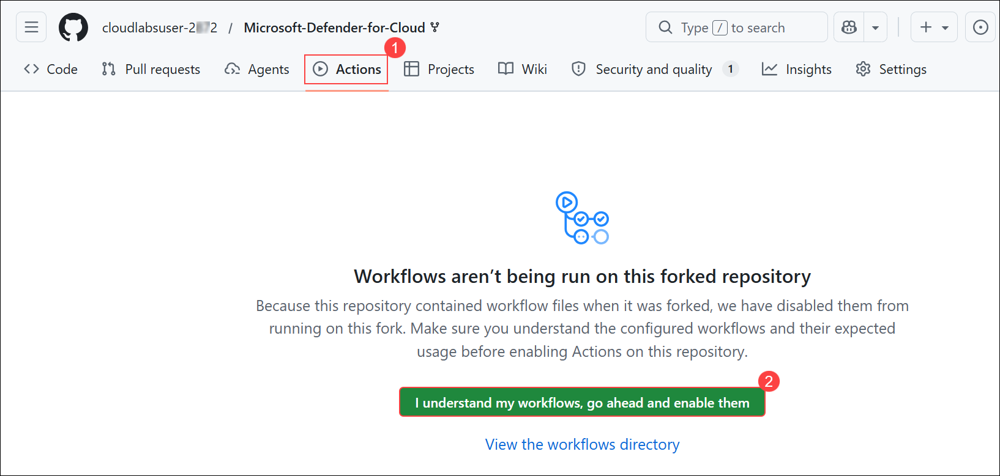

1.	Click on **New workflow**.

      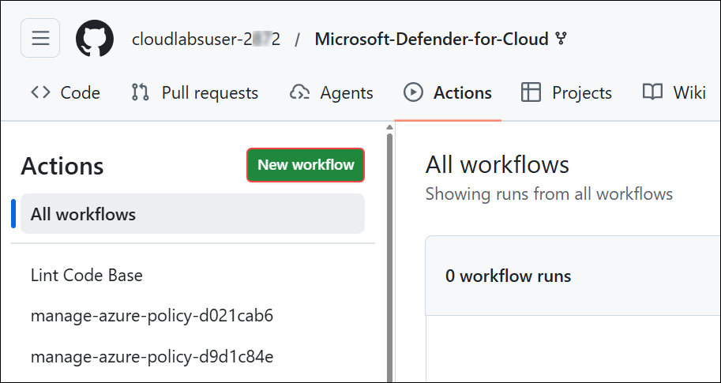

1.	Next, for **Choose a workflow** click on **set up a workflow yourself**.  

      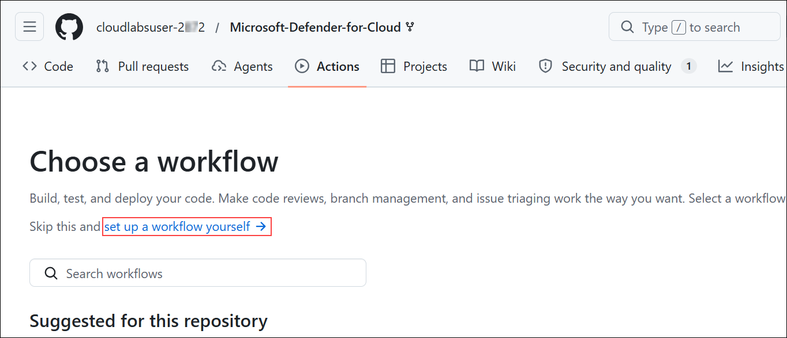

1. Enter the name for your workflow file as **msdevopssec.yml (1)**. Then copy and paste the following sample action workflow into the **Edit new file (2)** tab. 

      ```
      name: MSDO IaC Scan
         
      on:
           # Triggers the workflow on push or pull request events but only for the main branch
           push:
             branches: [ main ]
         
           pull_request:
             branches: [ main ]
         
           workflow_dispatch:
         
      jobs:
           security:
             runs-on: ubuntu-latest
             continue-on-error: false
             strategy:
               fail-fast: true
         
             steps:
             - uses: actions/checkout@v3
         
             - uses: actions/setup-dotnet@v3
               with:
                 dotnet-version: |
                   5.0.x
                   6.0.x
         
             - name: Run Microsoft Security DevOps
               uses: microsoft/security-devops-action@preview
               continue-on-error: false
               id: msdo
               with:
                 categories: 'IaC'
         
             - name: Upload alerts to Security tab
               uses: github/codeql-action/upload-sarif@v2
               with:
                 sarif_file: ${{ steps.msdo.outputs.sarifFile }}
      ```
 
      

1.	Click on **Commit Changes** and click **Commit Changes** again. 

      

      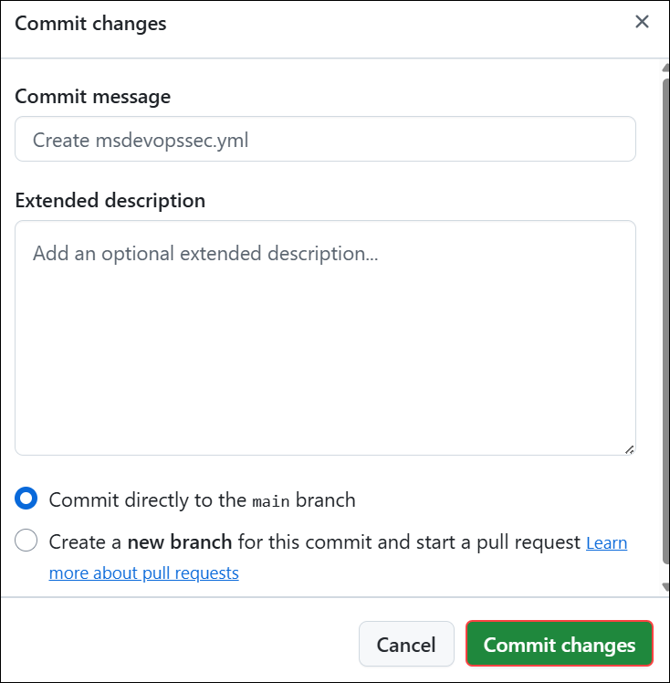

1. The process can take up to 5 minutes to complete. In the GitHub repository, select **Actions (1)**, and wait for the workflow runs under **All workflows (2)** to complete successfully.

      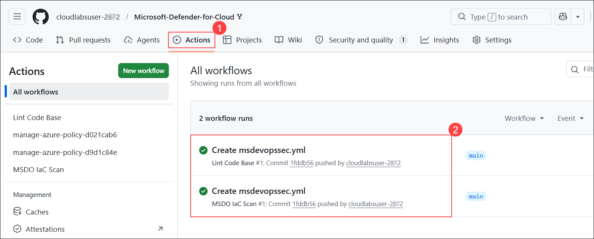

1. In the GitHub repository, select **Security and quality (1)**, choose **Secret scanning (2)**, and verify that the secret scanning alert is displayed under **Secret scanning alerts (3)**.

      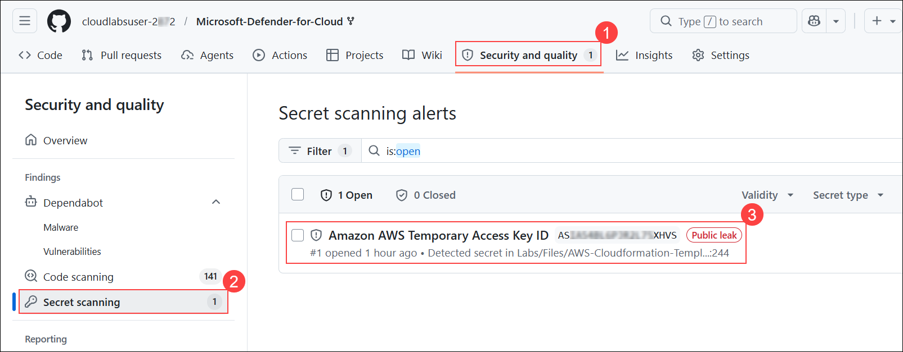

      <validation step="842515c8-c248-417b-b028-ef5d3abd0df4" />

> **Note**: To validate this Module you require **GitHub Username** and **Personal Access Token**.
>  
>   - You can find the GitHub username at the top of the GitHub repository page.
>     
>     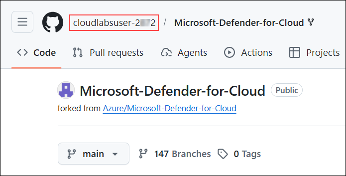
>  
>   - You can create a **Personal access token**, by selecting the **Profile (1)** icon, and then choose **Settings (2)**.
>     
>     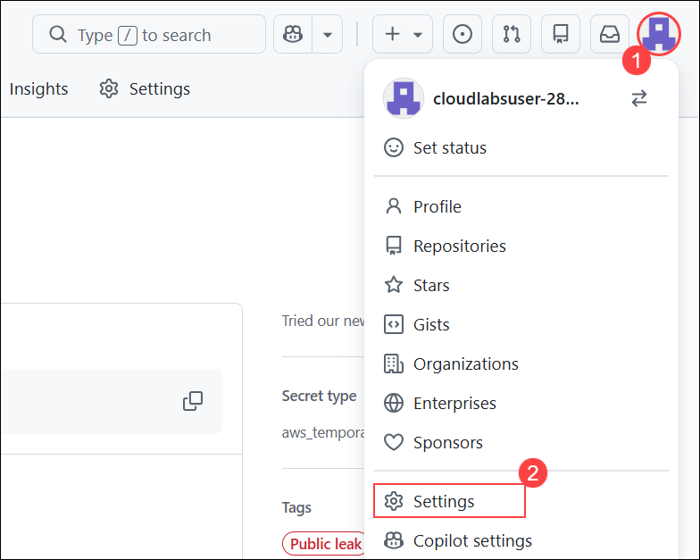
>   
>   - In the left navigation pane, select **Developer settings**.
>     
>     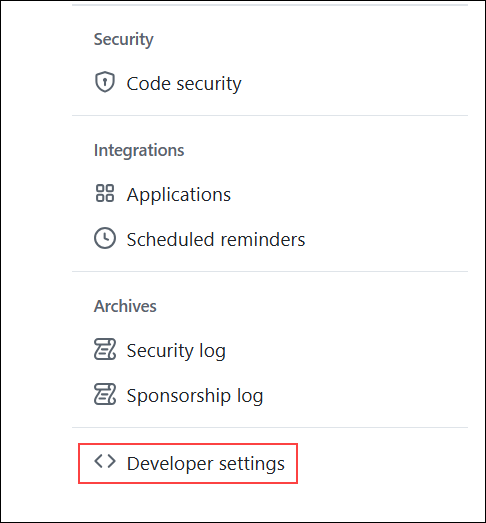
>   
>   - Expand **Personal access tokens (1)**, select **Tokens (classic) (2)**, choose **Generate new token (3)**, and then select **Generate new token (classic) (4)**.
>   
>       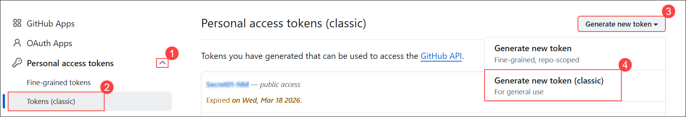
>
>   - Enter any name in the **Note (1)** field for the PAT, and then select the required scope options as shown in the screenshot **(2)**.
>  
>       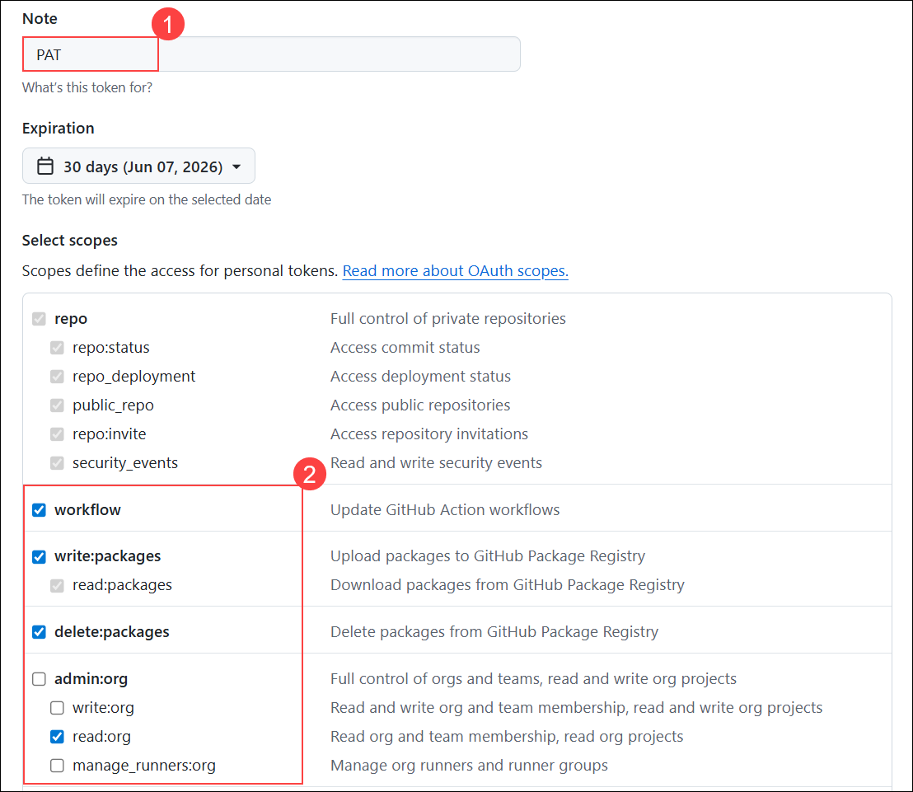
>
>   - Scroll down to the bottom of the page, and then select **Generate token**.
>  
>       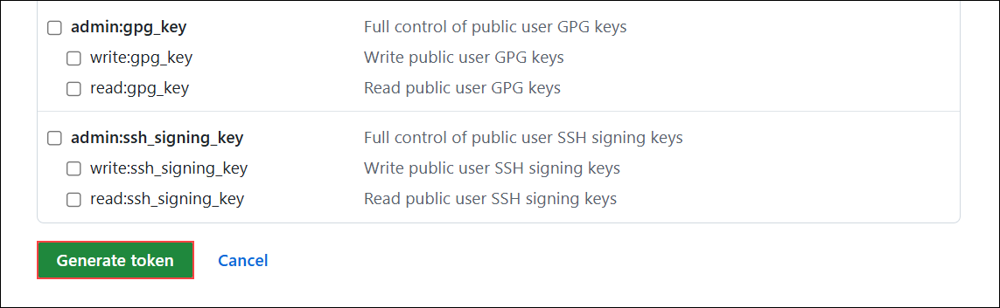
>
>   - Once the token is generated, select **Copy**, and then save the token in a text editor such as Notepad.
>  
>       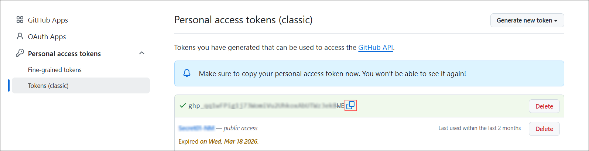
>
>   - Enter the GitHub username in **GitHubUserName (1)**, paste the copied PAT in **GitHubPersonalAccessToken (2)**, and then select **Submit (3)**.
>  
>       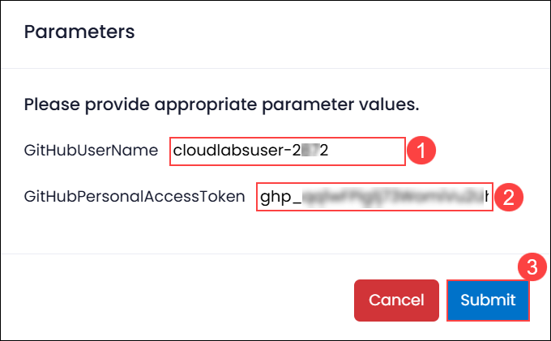
>
> **Congratulations** on completing the task! Now, it's time to validate it. Here are the steps:<br>
      - Navigate to the Lab Validation Page, from the upper right corner in the lab guide section.<br>
      - If not, carefully read the error message and retry the step, following the instructions in the lab guide.<br>
      - If you need any assistance, please contact us at labs-support@spektrasystems.com. We are available 24/7 to help!

This exercise includes configuring the Microsoft Security DevOps GitHub action to automate security checks in your workflows.

## Summary

In this module, you have learnt about how to connect your GitHub account to your organization's repositories, facilitating streamlined project management and collaboration. Next, you have configured the Microsoft Security DevOps GitHub action to automate security checks within your workflows, enhancing code security and compliance.

## Congratulations!! You have successfully completed the lab
